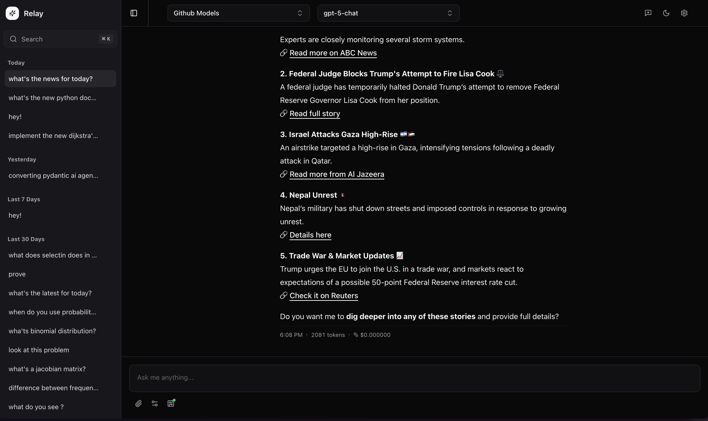
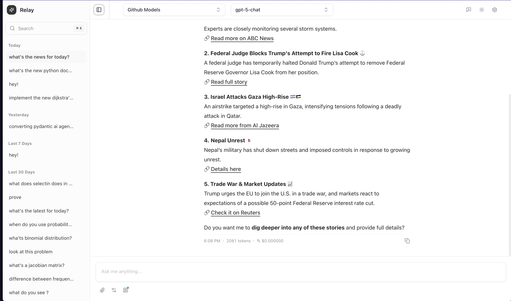
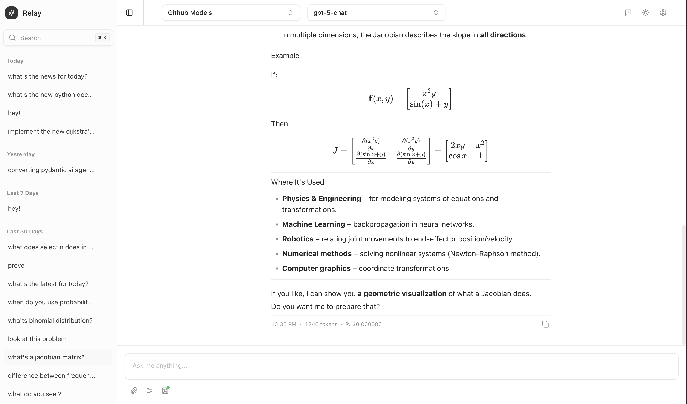
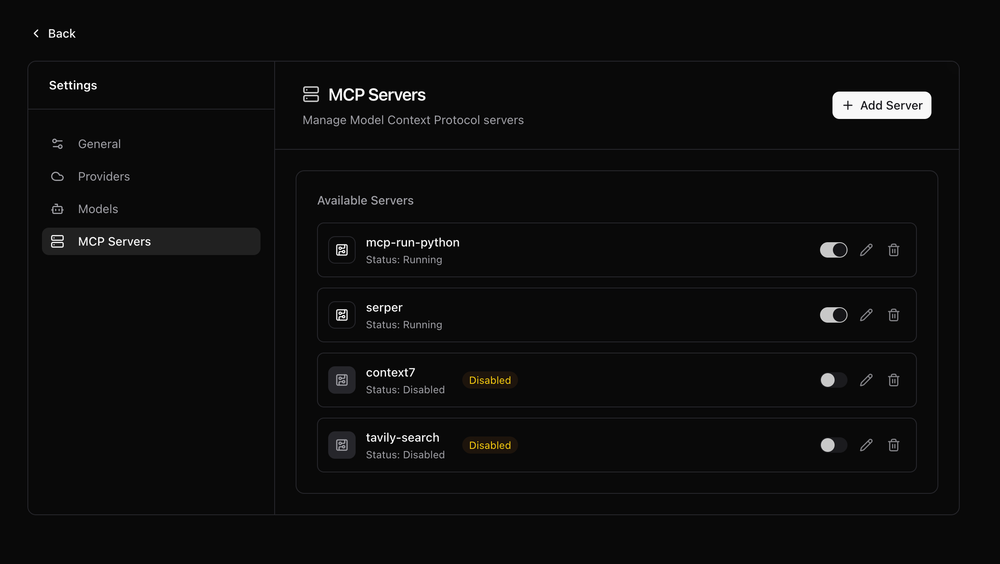
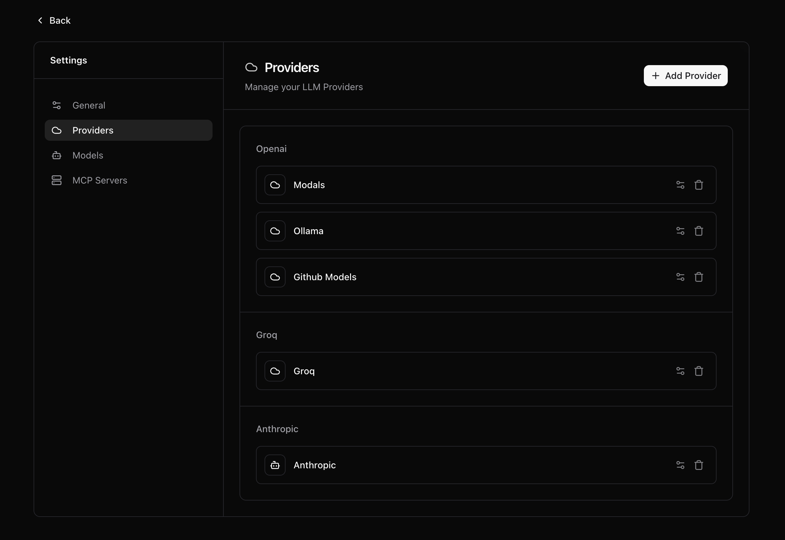

# Relay Connect

A modern, open-source LLM Studio frontend built with Next.js. Relay Connect provides a clean, intuitive interface for interacting with multiple AI providers and models through a unified chat experience.

## ✨ Features

- **Multi-Provider Support**: Connect to various AI providers (OpenAI, Anthropic, etc.)
- **Real-time Streaming**: Live streaming responses with tool calling support
- **Model Configuration Protocol (MCP)**: Advanced server management and tool integration
- **Modern UI**: Clean, responsive interface built with Tailwind CSS and Radix UI
- **Session Management**: Organize conversations with persistent chat sessions
- **Markdown Rendering**: Rich text rendering with syntax highlighting and math support
- **Theme Support**: Light and dark mode themes

## 📸 Screenshots

### 🌙 Dark & Light Mode

| Dark Mode                               | Light Mode                                |
| --------------------------------------- | ----------------------------------------- |
|  |  |

### 💬 Chat Interface



### 🔧 MCP Server Management



### ⚙️ Provider & Model Settings



## 🚀 Quick Start

### Prerequisites

- Node.js 18+
- pnpm (recommended) or npm
- [Relay Serve Backend](https://github.com/yamanahlawat/relay-serve) running

### Installation

1. **Clone the repository**

   ```bash
   git clone https://github.com/yamanahlawat/relay-connect.git
   cd relay-connect
   ```

2. **Install dependencies**

   ```bash
   pnpm install
   ```

3. **Set up environment variables**

   ```bash
   cp .env .env.local
   # Edit .env.local to point to your relay-serve backend URL
   # Default: NEXT_PUBLIC_RELAY_SERVE_HOST=http://localhost:8000
   ```

4. **Start the development server**

   ```bash
   pnpm dev
   ```

5. **Open your browser**
   Navigate to [http://localhost:3000](http://localhost:3000)

## 🔧 Backend Setup

Relay Connect requires the backend service to function. Please set up [Relay Serve](https://github.com/yamanahlawat/relay-serve) first:

```bash
git clone https://github.com/yamanahlawat/relay-serve.git
cd relay-serve
# Follow the setup instructions in that repository
```

## 📁 Project Structure

```
src/
├── app/                 # Next.js App Router pages
├── components/          # Reusable UI components
├── modules/
│   ├── chat/           # Chat functionality
│   └── settings/       # Settings and configuration
├── lib/                # Utilities and API clients
├── types/              # TypeScript type definitions
└── styles/             # Global styles
```

## 🛠 Development

### Available Scripts

- `pnpm dev` - Start development server
- `pnpm build` - Build for production
- `pnpm start` - Start production server
- `pnpm lint` - Run ESLint
- `pnpm type-check` - Run TypeScript checks

### Code Style

This project uses:

- **ESLint** and **Prettier** for code formatting
- **TypeScript** for type safety
- **Tailwind CSS** for styling
- **Conventional Commits** for commit messages

## 🤝 Contributing

We welcome contributions! Please see our [Contributing Guide](.github/CONTRIBUTING.md) for details.

1. Fork the repository
2. Create your feature branch (`git checkout -b feature/amazing-feature`)
3. Commit your changes (`git commit -m 'feat: add amazing feature'`)
4. Push to the branch (`git push origin feature/amazing-feature`)
5. Open a Pull Request

## 📝 License

This project is licensed under the MIT License - see the [LICENSE](LICENSE) file for details.

## 🙏 Acknowledgments

- Built with [Next.js](https://nextjs.org/)
- UI components from [Radix UI](https://www.radix-ui.com/)
- Styled with [Tailwind CSS](https://tailwindcss.com/)
- Icons from [Lucide React](https://lucide.dev/)

## 📞 Support

- 💬 [GitHub Discussions](https://github.com/yamanahlawat/relay-connect/discussions)
- 🐛 [Issue Tracker](https://github.com/yamanahlawat/relay-connect/issues)
- 💬 [Discord Community](https://discord.gg/V5AHYx72Yv)
- 📧 [Contact the maintainer](https://github.com/yamanahlawat)
